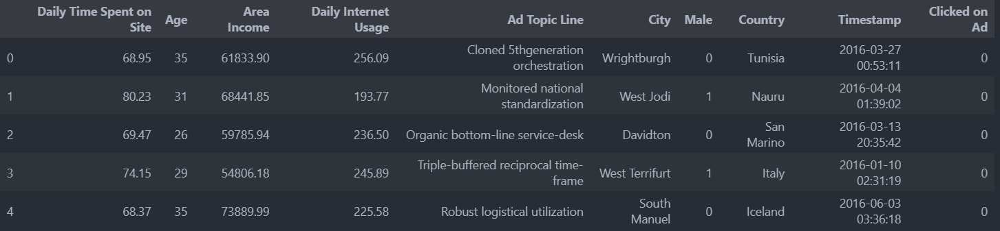
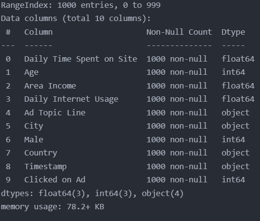
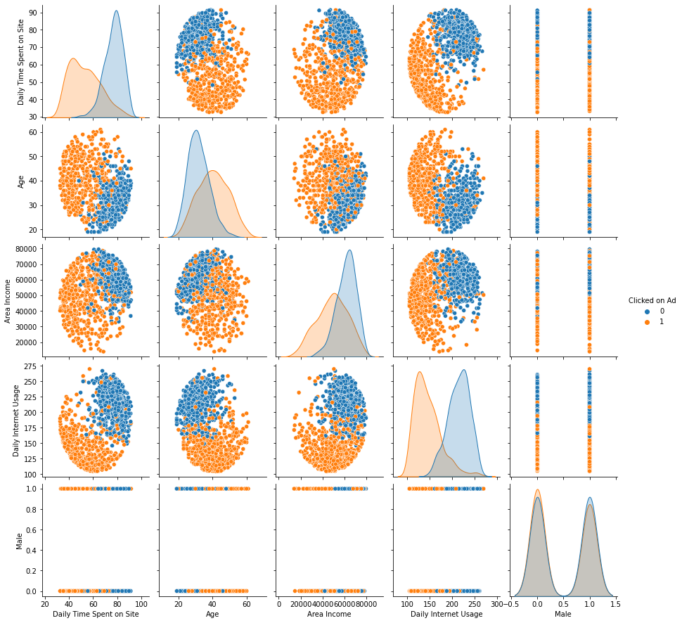
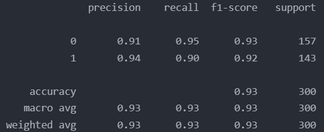

# logistic-regression-project
Coded in Python by Ömer Kural


## The Making of The Project

### 1 - Analysing the data
Before starting to coded the actual project I had to analyse the `advertising.csv` data with the `pandas` library.

```py
import pandas as pd
ad_data = pd.read_csv('advertising.csv')
ad_data.head
```

As it is seen on the image above, there are both numerical values and string values. String values are a problem for logistic regression.

```py
ad_data.info()
```

We can also see that there are no missing values in the data to deal with. Now we can proceed into the next step which is visualising the data.

### 2 - Visualising the data for analysis
I visualised the `advertising.csv` data with the `seaborn` library.

I plotted numerical data against eachother with a pair plot. I also added a hue defined by the "Clicked on Ad" column feature. This made me see the corrolation in the data more clearly.

```py
import seaborn as sb
sb.pairplot(data=ad_data, hue="Clicked on Ad")
```


As you can see, the data clearly corrolates with eachother. It divides clearly into two sections as seen on the plot. This is perfect for a logistic regression project. Also we can see that the "Male" column (Sex) doesn't mean anything for the data. The person being female or male (Male 0, Male 1) doesn't affect the person to click on the ad. So we can discard that column with all the other string based columns too.

### 3 - Cleaning the data
As this is a logistic regression project, we either have to get rid of the non-numerical values or we need to convert them to numerical values. The non-numerical values in this data represented no value in the accuracy of the project so I deleted the data with the `pandas.DataFrame.drop()` function. Now we are left with a clan dataset.

### 4 - Finalising the Project
After writing the actual logistical regression code, I tested it with a classification report.


The report shows that the project is a success. We can see that by looking at the values above. +0.9 is a great value for a machine learning project.

## Technologies
- Python 3.9
- seaborn
- pandas
- csv
- sklearn
- Logistic Learning Algorithms

## Credit
- Code by Ömer Kural